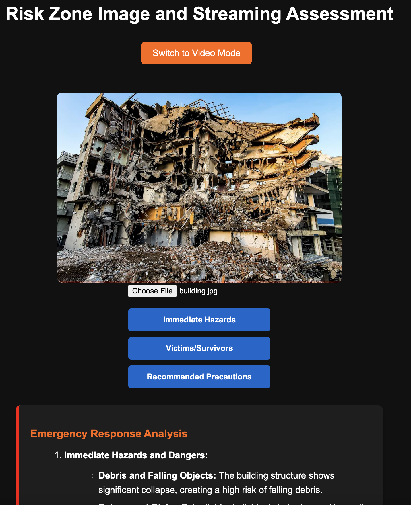

Risk Zone Image and Streaming Assessment
========================================

Inspiration
-----------
Places of destruction are also dangerous for first responders who need a fast and reliable way to analyze the situation to safely perform their work.

What it does
-------------
The application accepts image and video streaming and displays an analysis of the user's choice based on what an AI observes in the image or video.

How we built it
---------------
The backend of the app is made in Python and the frontend is built with HTML, JavaScript, and CSS. It utilizes advanced models to analyze the input.

Challenges we ran into
----------------------
We had to develop an app around what a first responder would have at the time of the disaster. It had to be intuitive, minimal, and fast to make a response.

Accomplishments that we're proud of
-----------------------------------
At the beginning, the group thought that the used prompts for the app would need to be a lot for a first responder, so we are proud of how fast an image can get analyzed, which is perfect for when time makes a difference between life and death.

What we learned
---------------
This is the first time working with videos in an application project. We learned how many tokens the AI model would use for a streaming video and continuous feedback.

What's next for Risk Zone Image and Streaming Assessment
--------------------------------------------------------
Since the app accepts video streaming, we could add options for continuous feedback from the AI to emphasize risks.
The photo side of the app: We could have the photo modified to better pinpoint areas of interest.
We could have a data bank with past rescues and places of destruction. Group the input with any past experiences so the AI would be better at suggesting certain actions.

Installation and Running
------------------------
1. **Clone the repository** and navigate to the `MainRiskApp` directory.

2. **Set up a Python virtual environment** (optional but recommended):

   .. code-block:: bash

      python3 -m venv venv
      source venv/bin/activate

3. **Install dependencies**:

   .. code-block:: bash

      pip install flask openai python-dotenv pillow

4. **Add your OpenAI API key**:
   - Place your OpenAI API key in a file named `key.txt` inside the `risk-assesment-app` directory.

5. **Run the application**:

   .. code-block:: bash

      cd risk-assesment-app
      python app.py

6. **Open your browser** and go to `http://127.0.0.1:5000` to use the app.

Screenshot
----------

